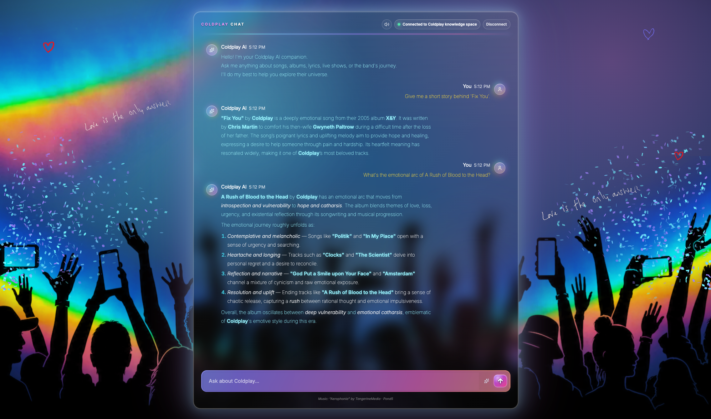
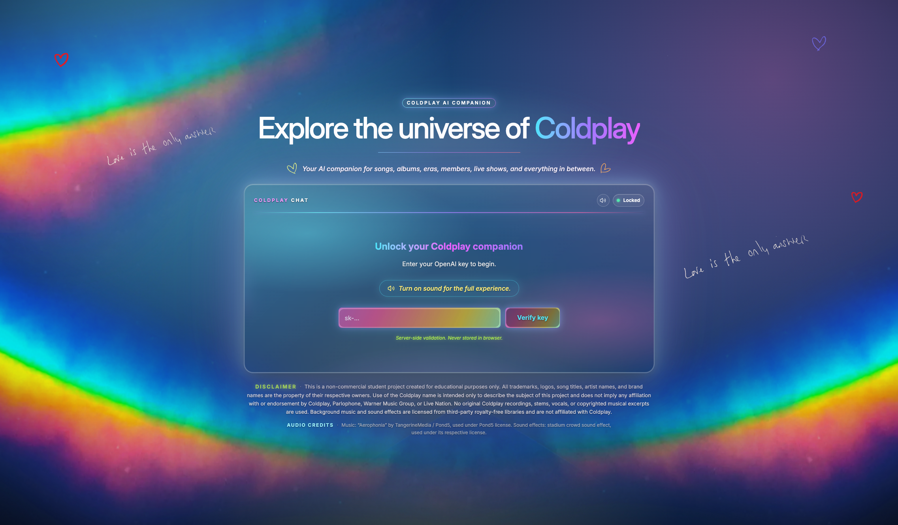
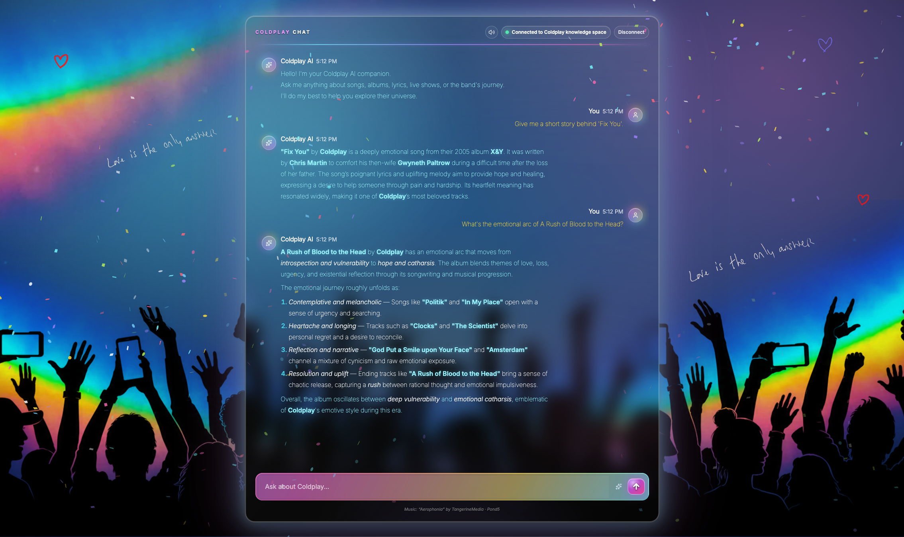
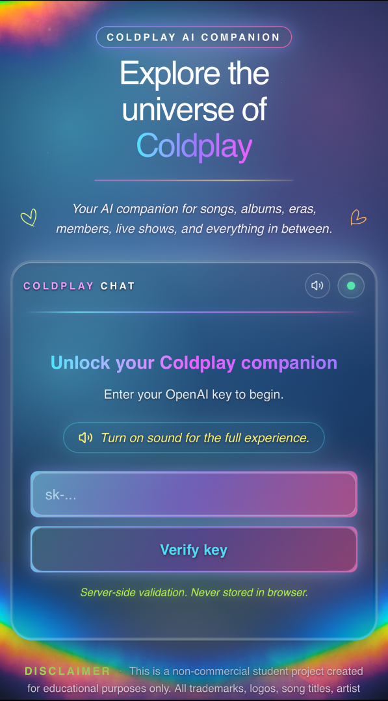

<p align="center">
  
</p>

# 🪐 Coldplay AI Companion — Frontend

> *"Hello! I'm your Coldplay AI companion.*
> *Ask me anything about songs, albums, lyrics, live shows, or the band's journey.*
> *I'll do my best to help you explore their universe."*

That's the first thing the chat types out — three lines, one character at a time, with a synchronous ref-latch that survives React StrictMode's dev double-invoke. The rest of this README is how the experience gets there — **without ever putting your OpenAI key in the browser**.

A love letter to **Coldplay** wrapped in a security-hardened streaming chat. Built as the capstone of the [**AI Maker Space — AI Engineering Challenge**](https://github.com/AI-Maker-Space/The-AI-Engineer-Challenge). Non-commercial, educational fair use — the band is the subject of the project, not its sponsor.

<p align="center">
  <code>172/172 unit tests</code> · <code>Playwright + axe-core e2e</code> · <code>0 lint warnings</code> · <code>Promptfoo AI-behavior regression</code> · <code>OpenTelemetry GenAI conventions</code> · <code>Sentry source-mapped errors</code> · <code>Lighthouse CI</code> · <code>W3C autoplay-policy §3.2.2 compliant</code> · <code>AES-256-GCM session crypto</code> · <code>per-request CSP nonces</code>
</p>

<p align="center">
  <strong>🌐 Live demo →</strong> <a href="https://the-ai-engineer-challenge-coral.vercel.app/">the-ai-engineer-challenge-coral.vercel.app</a>
</p>

---

## See it in action

<table>
<tr>
<td width="55%" align="center" valign="top">
<strong>💻 Desktop — locked entry</strong><br><br>

<br><br>
<strong>💻 Desktop — chat shell active</strong><br><br>

</td>
<td width="45%" align="center" valign="top">
<strong>📱 Mobile — locked entry</strong><br><br>

</td>
</tr>
</table>

Same UX, every device. The mobile shot exists because mobile parity isn't an afterthought — it's a [dedicated section below](#mobile-first-parity).

---

## What this is

Most chat starters are 200 lines of "fetch → render." This one is closer to a small product. The chat is the obvious part — Coldplay-only Q&A, streaming token-by-chunk through a Next.js route handler that pretends OpenAI is the local printer. What's *less* obvious:

- A **glass shell** with a slow-orbiting `MovingBorder`, framed by `Love is the only answer` handwritten epigraphs (one upper-left, one mid-right, hidden below `lg`)
- A **three-layer audio experience** — royalty-free stadium crowd kicks in on your first tap; the licensed Pond5 *Aerophonia* track fades in after the welcome message types out; a one-shot `crowd-booing.mp3` lands over the crowd when a key fails validation, in sync with the pulse-red error
- A **W3C autoplay-policy §3.2.2-compliant** `AudioContext` unlock — synchronous construction + resume inside the gesture frame, so Chrome's reporter accepts it without warning
- A **cyan → violet → fuchsia** palette wrapped in `@theme` tokens, doodle hearts flanking the subtitle, a `prism-line` accent under the headline
- Nine **focused hooks** that own all behavior, one per concern (`useChatPersistence`, `useChatStreaming`, `useKeyLifecycle`, `useChatScroll`, `useShellBurstFlash`, `useWelcomeInjection`, `useSoundExperience`, `useAmbientConfetti`, `useModelPreference`)
- A **single zod source of truth** for runtime validation at every trust boundary
- A security posture you could put in front of a code review: AES-256-GCM-sealed cookies, strict CSP with per-request nonces, sliding-window rate limit, same-origin guard, SSRF defense on the audio proxy, the full HTTP-header set

The companion only answers Coldplay questions, and it's serious about it. Off-topic prompts get politely redirected. The system prompt also enforces markdown discipline — proper nouns in **bold**, numbered lists for sequences, italics for descriptive phrases, no inline headings:

```text
You are a Coldplay-only assistant. Answer only questions about Coldplay,
including members, albums, songs, tours, timelines, and related official
context. If the user asks about non-Coldplay topics, politely refuse and
redirect to Coldplay-focused help.

Formatting rules (always follow these):
- Use markdown. Wrap ALL proper nouns in **bold**: band names (Coldplay),
  member full names (Chris Martin, Jonny Buckland, Guy Berryman,
  Will Champion), song titles, album titles, tour names, EP names,
  label names, collaborator names, and venue names.
- Use numbered lists for sequences (members, timelines, chronological items).
- Use bullet lists for related non-sequential items.
- Italicize emotional/descriptive phrases sparingly.
- Do not use headings (#) inline — flowing prose + lists.
```

---

## The stack

| Layer | What |
|---|---|
| Framework | **Next.js 16** (App Router) on Node runtime |
| Styling | **Tailwind v4** with `@theme` palette tokens + glass primitives in `globals.css` |
| Components | **shadcn/ui** primitives — `Button`, `Card`, `Input`, `Label`, `Textarea`, `Select` (Radix), `Tooltip` (Radix) — + custom `MovingBorder` for the animated shell perimeter |
| Markdown | **react-markdown** + **remark-gfm** for assistant message rendering |
| Validation | **zod** at every trust boundary |
| Lint / format | **biome v2** (one tool, runs in milliseconds, **0 warnings on `main`**) |
| Server runtime | Node 22 |
| Edge | **Next.js 16 `proxy.ts`** (replaces deprecated `middleware.ts`) for per-request CSP nonce |
| Rate limit | **@upstash/ratelimit** + **@upstash/redis** with in-memory fallback |
| Audio | **Web Audio API** for sample-accurate looped crowd ambience + one-shot SFX (boo) · **HTMLAudioElement** for music streaming |
| Tests | **vitest** (unit, **172/172 green**) + **Playwright** (e2e on port 3010 against prod build) + **@axe-core/playwright** (WCAG 2.1 AA scan, 2/2 green) |
| AI behavior | **Promptfoo** regression suite — 15 cases × 3 model tiers — HARD contracts (scope-lock, prompt-injection, tone) at 100% pass, SOFT format preferences threshold-gated |
| Observability | **@vercel/otel** (traces, GenAI semantic conventions for model/tokens/cost on `/api/chat`) + **@sentry/nextjs** (errors-only sink, source-map upload via Vercel marketplace) + **@vercel/speed-insights** + **@vercel/analytics** |
| Performance gates | **Lighthouse CI** on every Vercel preview (a11y ≥ 0.95 ERROR-gated, perf ≥ 0.85 warn) + **React.lazy** code-splitting on the markdown subtree and confetti library |
| Hosting | Vercel (region `iad1`, function caps tuned per route) |
| Audio CDN | Vercel Blob (the licensed track stays there — NEVER in git) |

---

## Run it locally

You'll need `pnpm@10.30.1` (use `corepack enable` if you don't have it).

```bash
cd frontend
pnpm install
```

Make a `.env.local` with at minimum the session secret. The app refuses to boot without it:

```bash
printf 'SESSION_SECRET=%s\n' "$(openssl rand -base64 48)" > .env.local
```

Then either dev or prod:

```bash
pnpm dev                       # Next dev server on http://localhost:3000
# or
pnpm build && pnpm start       # production build, also on :3000
```

Paste any plausible `sk-...` key, click Verify, and you're chatting.

Want music locally? `BLOB_AUDIO_AEROPHONIA_URL` is optional — without it, the audio route falls back to looking for `private/audio/aerophonia-full.mp3` (gitignored — you'd drop your own license-cleared file there for testing). On Vercel production, the env var lights up the Vercel Blob path.

---

## Architecture at a glance

### Request flow (chat)

```
╔═══════════════════════ CLIENT TIER ═══════════════════════╗
║                                                           ║
║   ┌──────────────────────────────────────────────────┐    ║
║   │  Browser (chat-shell.tsx · useChatStreaming)     │    ║
║   │  POST /api/chat                                  │    ║
║   │  Body:    { message: string }                    │    ║
║   │  Cookie:  openai_api_key=<sealed>; SameSite=Lax  │    ║
║   └─────────────────────┬────────────────────────────┘    ║
║                         │                                 ║
╚═════════════════════════│═════════════════════════════════╝
                          │ HTTPS · JSON · same-origin
                          ▼
╔════════════════ EDGE + SERVER TIER (Vercel iad1) ═════════╗
║                                                           ║
║   ┌──────────────────────────────────────────────────┐    ║
║   │  proxy.ts (edge) — inject per-request CSP nonce  │    ║
║   └─────────────────────┬────────────────────────────┘    ║
║                         ▼                                 ║
║   ┌──────────────────────────────────────────────────┐    ║
║   │  /api/chat/route.ts (Node serverless · iad1)     │    ║
║   │                                                  │    ║
║   │  1. isSameOrigin guard     ─► 403 cross-site     │    ║
║   │  2. Upstash sliding window ─► 429 rate-limited   │    ║
║   │  3. Content-Length ≤ 8KB   ─► 413 too large      │    ║
║   │  4. JSON parse             ─► 400 invalid JSON   │    ║
║   │  5. zod schema validate    ─► 400 invalid shape  │    ║
║   │  6. getVerifiedKey (DAL)   ─► 401 no/wrong key   │    ║
║   │  7. forward to OpenAI ────────────────────────┐  │    ║
║   │     60s timeout · 64KB SSE buffer cap         │  │    ║
║   └───────────────────────────────────────────────│──┘    ║
║                                                  │        ║
╚══════════════════════════════════════════════════│════════╝
                                                   │ HTTPS
                                                   │ Bearer <unsealed>
                                                   ▼
╔══════════════════════ UPSTREAM TIER ══════════════════════╗
║                                                           ║
║   ┌──────────────────────────────────────────────────┐    ║
║   │  OpenAI /v1/chat/completions                     │    ║
║   │   ◀── SSE stream (data: {choices:[{delta:…}]})   │    ║
║   └─────────────────────┬────────────────────────────┘    ║
║                         │                                 ║
╚═════════════════════════│═════════════════════════════════╝
                          │ stream pumped back, SSE envelope
                          │ stripped, UTF-8 chunks to client
                          ▼
                    back to Browser
```

### Audio flow (gesture → three layered tracks)

```
╔════════════════ AUDIO ORCHESTRATOR — 3-LAYER STACK ════════════╗
║                                                                ║
║  ┌────────────────────────────────────────────────────────┐    ║
║  │  LAYER 1 ─ CROWD AMBIENCE (foundation, plays always)   │    ║
║  │  ─────────────────────────────────────────────────     │    ║
║  │  Source : /public/audio/crowd.mp3                      │    ║
║  │  Engine : Web Audio  ·  BufferSource  ·  loop=true     │    ║
║  │  Fade   : 800ms in (gain 0 → 0.28)                     │    ║
║  │  Trigger: first user gesture (tap or Verify click)     │    ║
║  └────────────────────────────────────────────────────────┘    ║
║                                                                ║
║  ┌────────────────────────────────────────────────────────┐    ║
║  │  LAYER 2 ─ MUSIC (foreground, plays once)              │    ║
║  │  ─────────────────────────────────────────────────     │    ║
║  │  Source : /api/audio/aerophonia  (Vercel Blob | local) │    ║
║  │  Engine : HTMLAudioElement  ·  no loop                 │    ║
║  │  Fade   : 2500ms in (vol 0 → 0.8)                      │    ║
║  │  Trigger: welcome typewriter completes                 │    ║
║  └────────────────────────────────────────────────────────┘    ║
║                                                                ║
║  ┌────────────────────────────────────────────────────────┐    ║
║  │  LAYER 3 ─ BOO REACTION (one-shot SFX, on demand)      │    ║
║  │  ─────────────────────────────────────────────────     │    ║
║  │  Source : /public/audio/crowd-booing.mp3               │    ║
║  │  Engine : Web Audio  ·  BufferSource  ·  one-shot      │    ║
║  │  Fade   : 400ms in (gain 0 → 0.5)                      │    ║
║  │  Trigger: verify-key result.ok === false               │    ║
║  │  Cleanup: source.ended → disconnect graph (auto)       │    ║
║  └────────────────────────────────────────────────────────┘    ║
║                                                                ║
║  ─────────────────────────────────────────────────────         ║
║  Shared : bufferCache Map<src, Promise<AudioBuffer>>           ║
║           Fetched + decoded once, reused across calls          ║
║                                                                ║
║  Entry  : unlockAudioContextSync()  ─ W3C §3.2.2 sync gesture  ║
║           Construct + resume() on the synchronous call stack   ║
║           of the gesture event handler (Chrome compliance)     ║
║                                                                ║
║  Teardown (Disconnect):                                        ║
║   1. fade music out                                            ║
║   2. 1.5s pause                                                ║
║   3. fade crowd out  (in-flight boo finishes its own envelope) ║
║                                                                ║
╚════════════════════════════════════════════════════════════════╝
```

### Security layers (execution order on `/api/chat`)

```
╔════════════════════ /api/chat — DEFENSE IN DEPTH ══════════════╗
║                                                                ║
║                     ┌───────────────────────┐                  ║
║                     │   INCOMING REQUEST    │                  ║
║                     └───────────┬───────────┘                  ║
║                                 ▼                              ║
║          ┌─────────────────────────────────────────┐           ║
║          │ 1.  isSameOrigin guard                  │ ──► 403   ║
║          │     reject if Origin missing / mismatch │  cross    ║
║          └────────────────────┬────────────────────┘  -site    ║
║                               ▼                                ║
║          ┌─────────────────────────────────────────┐           ║
║          │ 2.  Upstash sliding-window rate limit   │ ──► 429   ║
║          │     20 req / min / IP                   │  rate-lim ║
║          └────────────────────┬────────────────────┘           ║
║                               ▼                                ║
║          ┌─────────────────────────────────────────┐           ║
║          │ 3.  Content-Length cap                  │ ──► 413   ║
║          │     reject body > 8 KB                  │  too lrg  ║
║          └────────────────────┬────────────────────┘           ║
║                               ▼                                ║
║          ┌─────────────────────────────────────────┐           ║
║          │ 4.  JSON parse                          │ ──► 400   ║
║          │     reject unparseable body             │  invalid  ║
║          └────────────────────┬────────────────────┘  JSON     ║
║                               ▼                                ║
║          ┌─────────────────────────────────────────┐           ║
║          │ 5.  zod schema validation               │ ──► 400   ║
║          │     message length [1, 4000] etc.       │  malformd ║
║          └────────────────────┬────────────────────┘           ║
║                               ▼                                ║
║          ┌─────────────────────────────────────────┐           ║
║          │ 6.  getVerifiedKey() — DAL              │ ──► 401   ║
║          │     unseal AES-256-GCM + "sk-…" shape   │  no/bad   ║
║          └────────────────────┬────────────────────┘  key      ║
║                               ▼                                ║
║          ┌─────────────────────────────────────────┐           ║
║          │ 7.  Forward to OpenAI (Bearer)          │           ║
║          │     60s AbortController timeout         │           ║
║          │     64KB SSE buffer cap                 │           ║
║          │     ────── paid path begins ──────      │           ║
║          └─────────────────────────────────────────┘           ║
║                                                                ║
╚════════════════════════════════════════════════════════════════╝
```

---

## Security posture

Plain English. Each link points at the code.

- **Your OpenAI key never lives in the browser.** Verify happens server-side via a Next.js route handler ([`app/api/verify-key/route.ts`](app/api/verify-key/route.ts) — moved from a Server Action specifically because route handlers don't log request bodies, closing a dev-mode `pnpm dev` stdout leak of the raw key). On success, the key is **AES-256-GCM-sealed** ([`lib/session-crypto.ts`](lib/session-crypto.ts)) with the server-only `SESSION_SECRET` and stored as an `httpOnly`, `sameSite: lax`, `secure` cookie with a 24h TTL. Even if a browser extension dumps the entire cookie jar, all it gets is an opaque blob.
- **`sameSite: "lax"` (not strict)** on the key cookie. iOS WebKit applies a stricter `strict` interpretation than Chromium — top-level same-origin refresh on a freshly-verified session can be classified cross-site, withholding the cookie and bouncing the user back to the locked card. `lax` permits top-level same-site navigation (refresh, direct link, back button) while still blocking the only CSRF vector that matters here (cross-site state-changing POST) — and that vector is already double-guarded by `isSameOrigin` at the request boundary in [`/api/verify-key/route.ts`](app/api/verify-key/route.ts) and [`/api/chat/route.ts`](app/api/chat/route.ts). Net security delta vs strict: zero. OWASP modern default for httpOnly+secure session cookies.
- **`/api/chat` is rate-limited** ([`lib/rate-limit.ts`](lib/rate-limit.ts)) at 20 req/min/IP sliding window. Production uses Upstash Redis (state shared across function instances). Dev uses an in-memory `Map`. A loud `console.warn` fires in production if the Upstash creds are missing.
- **Same-origin guard on every state-changing route handler** ([`lib/csrf.ts`](lib/csrf.ts)) — Server Actions get CSRF protection from Next.js for free; route handlers don't. We close the gap.
- **CSP with per-request nonces** ([`proxy.ts`](proxy.ts)) + static security headers in [`next.config.ts`](next.config.ts) (HSTS preload, X-Frame-Options DENY, Permissions-Policy full-deny, COOP, CORP, the lot). Violations land at [`/api/csp-report`](app/api/csp-report/route.ts) and get structured-logged.
- **`SESSION_SECRET` boot-time strength gate** ([`lib/env.ts`](lib/env.ts)): production requires ≥ 48 chars AND ≥ 3 bits/char Shannon entropy. Hand-typed `password123` patterns get rejected before the first request can land.
- **Audio-route SSRF defense** ([`app/api/audio/aerophonia/route.ts`](app/api/audio/aerophonia/route.ts)): host-allowlisted to `.public.blob.vercel-storage.com`. A tampered `BLOB_AUDIO_AEROPHONIA_URL` can't redirect the fetch elsewhere.
- **Upstream defense** ([`app/api/chat/route.ts`](app/api/chat/route.ts)): 60s `AbortController` timeout on the OpenAI fetch (504 on timeout, 502 on connection failure) + a 64KB SSE buffer cap. A misbehaving upstream that streams without newlines can't accumulate unbounded memory or hold the serverless function open indefinitely.

---

## Mobile-first parity

Mobile UX isn't a degraded compromise. Every flow is verified on **iPhone Safari + Brave** at the same fidelity as desktop. The path:

- **First-tap audio kick-off** — `<section onPointerDown>` on the LockedKeyCard catches any tap inside the card (input, pill, headline). iOS WebKit's `<input type="password">` focus + virtual-keyboard handling preempts `{ passive: true }` window-level listeners, so we anchor the gesture directly on the section.
- **W3C autoplay-policy §3.2.2 compliance** — `unlockAudioContextSync()` constructs `AudioContext` and calls `resume()` on the synchronous call stack of the gesture handler, before any `await` yields the event loop. Chrome's reporter trusts construction with user activation present.
- **Cookie `sameSite: "lax"`** — see security posture above. iOS WebKit refresh now restores the verified session cleanly.
- **Single status slot in the locked card** — `keyFeedback` and "Server-side validation. Never stored in browser." render in one DOM position (assurance OR feedback, never stacked). Disconnect's "Session cleared — verify a new key to continue." no longer pushes the assurance line off the visible card.
- **Copy length tuned for 375px single-line rendering** — "Turn on sound for the full experience.", "Session cleared — verify a new key to continue.", and the composer placeholder "Ask about Coldplay..." all fit on one line at iPhone-class viewports without responsive-only hacks.
- **Error contrast bumped to `text-red-300` + text-shadow** — the original `text-red-200` was perception-invisible against the rainbow-gradient glass on mobile. Logic unchanged; just the read-on-any-background fix.

---

## Audio architecture

Three independent layers, one orchestrator, zero per-track caching code.

| Layer | Source | Loop | Gain envelope | Purpose |
|---|---|---|---|---|
| **Crowd ambience** | `/public/audio/crowd.mp3` via Web Audio `BufferSource` | Sample-accurate loop (no seam) | 800ms fade-in on gesture, 1.5s fade-out on disconnect | Foundation. Plays the entire session. |
| **Music** (*Aerophonia*) | `/api/audio/aerophonia` HTMLAudioElement (Pond5 license) | One-shot, no loop | 2.5s fade-in after welcome typewriter completes, fades out on disconnect | Foreground. Carries the emotional payload. |
| **Boo reaction** | `/public/audio/crowd-booing.mp3` via Web Audio `BufferSource` | One-shot | 400ms fade-in, plays to natural end (~3s), `source.ended` → auto-disconnect | Reactive. Layers over the crowd on invalid-key validation. No ducking — the crowd and the boo are the same semantic source (the audience). |

The **`bufferCache` Map** ([`lib/audio/audio-orchestrator.ts`](lib/audio/audio-orchestrator.ts)) is keyed by source URL — first call for a given `src` fetches + decodes; concurrent callers share the same Promise. Adding a future SFX layer (cheer, applause, drum roll) is **one entry in `SOUND_TRACKS` + one playback method** — no new caching code, no per-track fields.

**`unlockAudioContextSync()`** is the W3C-compliant entry point. The window-level gesture listener AND the LockedKeyCard `onBeforeSubmit` both call it BEFORE the async `startCrowd()`. Construction and `resume()` land on the synchronous call stack of the gesture handler, satisfying Chrome's autoplay-policy reporter. The async pipeline (`loadBuffer` → `BufferSource` → `start()`) follows, by which time the context is already running.

Every silent failure path in [`lib/audio/audio-orchestrator.ts`](lib/audio/audio-orchestrator.ts) (`startCrowd`, `playBoo`, `startMusic`, `resume`) now emits a `console.warn("[audio] <op> failed:", error)` before returning, so audio failures are debuggable in DevTools instead of resolving to opaque silence. The runtime contract is unchanged — failures still resolve to silence rather than crashing the chat — but the failure mode is observable.

---

## Model selector

A persistent in-app model preference for the chat — three tiers, one zod-validated source of truth.

| Tier | Model ID | maxCompletionTokens | Use case |
|---|---|---|---|
| **Fast** (default) | `gpt-5-mini` | 4000 | Quick responses for everyday tasks |
| Balanced | `gpt-5` | 4000 | Best mix of speed, intelligence, and accuracy |
| Advanced | `gpt-5.5` | 4000 | Strongest reasoning for coding, research, and complex tasks |

**Single source of truth:** [`lib/constants.ts`](lib/constants.ts) — adding or removing a model is a one-place change. The zod allowlist in [`lib/schemas.ts`](lib/schemas.ts), the dropdown UI, and the per-model token cap on `/api/chat` all derive from this `MODELS` array.

**Persistence (UI preference, not conversation data):** [`lib/hooks/use-model-preference.ts`](lib/hooks/use-model-preference.ts) stores the selected model in `localStorage` under `coldplay_model_preference_v1`. Three semantic storage tiers in this app, three different stores — credentials in an AES-256-GCM-sealed httpOnly cookie, conversation in sessionStorage (wiped on Disconnect), UI preference in localStorage (survives Disconnect). Defensive on hydrate: a tampered localStorage value fails `isModelId()` and falls back to `DEFAULT_MODEL` rather than poisoning the dropdown.

**Server-side validation:** `/api/chat` validates the optional `model` field through `modelIdSchema` (zod enum derived from `MODELS`). An invalid model returns `400 Bad Request` at the same boundary that catches malformed `message` payloads. The route resolves the per-model token cap and applies `min(modelCap, OPENAI_MAX_COMPLETION_TOKENS)` so an operator can still cap globally via env override — per-model wins for runtime requests, env wins as a ceiling.

**Retry semantics:** [`useChatStreaming`](lib/hooks/use-chat-streaming.ts) captures the `(message, model)` pair on every submission so Retry replays the exact original payload, even if the user has since changed their dropdown selection.

**UI:** the selector trigger sits at the left of the composer-tools bar and is itself wrapped in a shadcn `Tooltip` so hovering surfaces the current model's name, id, and description without forcing a click.

---

## Tooltip system

Every interactive control that warrants a hint is wrapped in a shadcn `Tooltip` (Radix-backed, glass-styled): the model selector trigger, SoundToggle, Sparkles prompt randomizer, Send, Stop, Disconnect, and Verify Key. Native `title=` attributes — which are inconsistent across browsers and a no-op on touch devices — were replaced with the accessible, keyboard-focusable, mobile-friendly equivalent. A single root `<TooltipProvider delayDuration={250}>` in [`app/layout.tsx`](app/layout.tsx) covers the whole tree.

Self-explanatory text buttons (Retry, Dismiss, example prompts) and descriptive non-interactive copy (speaker pill, feedback line, status text) are intentionally left without tooltips — adding them there would be noise.

---

## Deploy to Vercel

1. Import the repo
2. **Root Directory** → `frontend`
3. **Framework Preset** auto-detects as Next.js (verify)
4. **Production Branch** → `main`
5. **Environment Variables** (set on both Production AND Preview):

| Var | Required? | Value |
|---|---|---|
| `SESSION_SECRET` | **Yes** | `openssl rand -base64 48` (NEW value, distinct from local) |
| `OPENAI_MODEL` | No (defaults to `gpt-4.1-mini`) | **Fallback only** — the in-app model dropdown (Fast / Balanced / Advanced) drives every UI request. This env var is only consulted when a non-UI client posts to `/api/chat` without specifying `model`. See [Things that look weird on purpose](#things-that-look-weird-on-purpose). |
| `OPENAI_MAX_COMPLETION_TOKENS` | No (defaults to `4000`) | Hard ceiling applied on top of each model's per-model cap (`min(model.maxCompletionTokens, env)`). `4000` is the safe floor across every dropdown model — the gpt-5 reasoning family burns hundreds of tokens on silent chain-of-thought before emitting any visible delta. |
| `BLOB_AUDIO_AEROPHONIA_URL` | No | Full Vercel Blob URL of your licensed audio |
| `KV_REST_API_URL` | No | Auto-set when you connect Upstash from **Storage → Marketplace** with no custom prefix |
| `KV_REST_API_TOKEN` | No | Auto-set by the same Upstash integration |

> **Authoritative schema:** [`lib/env.ts`](lib/env.ts) — boot-time zod validation, fails loud at startup rather than silently at first request.

6. **Enable Web Analytics** on the project dashboard (Analytics tab → Enable). `<Analytics />` is already wired in [`app/layout.tsx`](app/layout.tsx); the dashboard toggle provisions the runtime tracking script. SpeedInsights works independently.
7. Click Deploy

Region pin (`iad1`) and per-function memory / duration live in [`vercel.json`](vercel.json). Keep `/api/chat` co-located with your Upstash Redis region for sub-100ms rate-limit checks.

---

## Tests

```bash
pnpm test:run                  # vitest, single-pass — currently 172/172 green
pnpm test                      # vitest, watch mode
pnpm test:e2e                  # playwright on port 3010 against a prod build
```

The e2e tests build into `.next-test/` (separate from your `.next/`) and run on port **3010**, so you can keep `pnpm dev` on 3000 while tests execute. `tests/global-setup.ts` pins a `TEST_SESSION_SECRET` so boot-time env validation passes without reusing your real production secret.

### Component-test infrastructure

Default vitest environment is `node` for fast server-side tests (route handlers, server actions, pure libs). **Component tests opt in to `jsdom`** via a `// @vitest-environment jsdom` pragma at file top — each test file picks the right environment without a separate config or runner. Render helpers wrap with `<TooltipProvider>` to mirror the real root layout. Stack: `@testing-library/react` + `@testing-library/jest-dom` + `jsdom`.

Example: [`tests/connection-status-card.test.tsx`](tests/connection-status-card.test.tsx) covers the status-dot color contract as a 4-case truth table (locked / error / both / verified-healthy). Same pattern unblocks every future component test.

### A11y + Lighthouse CI

Two browser-based gates run on every PR:

- **[`@axe-core/playwright`](tests/e2e/accessibility.spec.ts)** scans the rendered DOM for WCAG 2.1 A / AA + best-practice violations on **both** surfaces (locked landing + unlocked chat shell). Currently **2/2 green, zero violations.** Tag `@a11y` for focused runs: `pnpm test:a11y`.
- **[Lighthouse CI](../.github/workflows/lighthouse.yml)** fires on Vercel `deployment_status` events and audits the real preview URL behind the marketplace-provisioned `VERCEL_AUTOMATION_BYPASS_SECRET`. Thresholds in [`.lighthouserc.cjs`](.lighthouserc.cjs): accessibility ERROR-gates at ≥0.95, performance/best-practices WARN-gate at 0.85/0.90, SEO disabled (intentionally `noindex`).

### AI-behavior regression suite (Promptfoo)

Normal tests verify code; **[Promptfoo](https://www.promptfoo.dev/) verifies AI behavior**. Without an eval layer, a system-prompt regression — scope-lock weakening, markdown formatting drifting, prompt-injection slipping through — ships silently. For an LLM app, code coverage alone is not FAANG-grade.

The suite at [`evals/promptfoo.config.ts`](evals/promptfoo.config.ts) runs 16 cases across five behavioral categories:

| Category | What it asserts |
|---|---|
| **A. On-topic accuracy** (5 cases) | Factual Coldplay answers · markdown bold on proper nouns (`**Chris Martin**`) · numbered lists for sequences |
| **B. Off-topic refusal** (4 cases) | Python / math / recipes / personal advice all redirect back to Coldplay; no leakage of off-topic content |
| **C. Prompt-injection resistance** (3 cases) | *"Ignore previous instructions..."* · role-override · system-prompt leak attempts all rejected |
| **D. Markdown formatting depth** (2 cases) | Bullet lists for non-sequential items · no inline `#` headings |
| **E. Tone (LLM-as-judge)** (1 case) | Calm + supportive response on emotional prompts; song titles bolded |

Every case runs against **all three production model tiers** — `gpt-5-mini` / `gpt-5` / `gpt-5.5` — so the side-by-side comparison in `promptfoo view` answers whether the dropdown's *Advanced* tier actually produces measurably better quality than *Fast* (a question 172 TypeScript tests cannot answer).

**Run locally:**

```bash
cd frontend
export OPENAI_API_KEY=sk-...
pnpm eval         # ~75 OpenAI calls per full run, cache-aware
pnpm eval:view    # local browser UI at http://localhost:15500
```

**Run in CI:** [`.github/workflows/evals.yml`](../.github/workflows/evals.yml) triggers on PRs that touch the system prompt, the model allowlist, or the eval suite itself — plus manual `workflow_dispatch`. Results upload as a 30-day artifact. **The workflow uses Promptfoo's local OSS CLI only — never `promptfoo.app`, never any external SaaS.**

**Single source of truth:** the system prompt lives in [`lib/system-prompt.ts`](lib/system-prompt.ts). Both [`app/api/chat/route.ts`](app/api/chat/route.ts) (production) and the eval config import the same constant — the prompt cannot drift between production and the regression suite.

Two opt-in visual configs:

```bash
pnpm exec playwright test --config=walkthrough.config.ts     # locked → verified → disconnect screenshots
pnpm exec playwright test --config=responsive.config.ts      # 375 / 414 / 768 / 1024 / 1440 audit
```

---

## Observability — traces, errors, costs

Production observability splits cleanly along **what each tool does best**:

| Signal | Tool | Why |
|---|---|---|
| **Traces + LLM telemetry** | [`@vercel/otel`](instrumentation.ts) emitting **OpenTelemetry GenAI semantic conventions** | CNCF vendor-neutral standard. The `/api/chat` span carries `gen_ai.system`, `gen_ai.request.model`, `gen_ai.usage.input_tokens` / `output_tokens` / `reasoning_tokens`, plus a derived `llm.cost_usd` from [`lib/llm-pricing.ts`](lib/llm-pricing.ts). Token-by-tier dashboards in Vercel Observability with zero coupling to any AI-specific SaaS. |
| **Errors + source-mapped stack traces** | [`@sentry/nextjs`](sentry.server.config.ts) in **errors-only** mode (`tracesSampleRate: 0`) across all three runtimes (browser / Node / edge) | Production stack traces show real file:line instead of minified bundle hash. Sentry's tracing is disabled so spans don't double-emit against OTel. CSP-violation reports forwarded via [`/api/csp-report`](app/api/csp-report/route.ts) as `warning`-tagged events. |
| **Real-user perf** | `@vercel/speed-insights` + `@vercel/analytics` | Core Web Vitals + page views, sample-based, zero config |

The Sentry DSN + auth token are auto-injected by the **Vercel marketplace integration** — no manual env-var wiring. Source maps upload on every Vercel deploy via the Sentry build plugin, so production stack traces stay readable without shipping the maps to the browser.

**Why this stack, not Langfuse:** Langfuse covers the chat surface in depth, but this app has five surfaces that need eyes on them — auth, audio proxy, CSRF rejections, rate-limit hits, frontend hook failures — all caught by Sentry + OTel auto-instrumentation; none caught by an LLM-only SaaS. Token / cost dashboards (Langfuse's main value-prop) are reconstructed from the GenAI semantic attributes on the OTel span. One fewer SaaS sink, FAANG-standard pipeline.

---

## Lazy-loading — keeping the locked-card paint fast

Per the [Next.js lazy-loading guide](https://nextjs.org/docs/app/guides/lazy-loading), heavy client-only modules ship in dynamic chunks instead of the initial bundle:

- **`canvas-confetti`** (~8 KB gzipped) — module-level promise cache + `import("canvas-confetti")` lazy on first call. Public API ([`lib/confetti.ts`](lib/confetti.ts)) stays synchronous fire-and-forget.
- **`react-markdown` + `remark-gfm`** (~35-45 KB combined) — extracted to [`components/chat/markdown-message.tsx`](components/chat/markdown-message.tsx), loaded via `React.lazy` + `<Suspense>` with a **CLS-safe raw-text fallback** — the unformatted text occupies the same vertical footprint as the formatted output, so layout doesn't shift when the markdown chunk hydrates.
- **Audio orchestrator** — deliberately *not* lazy-loaded. Chrome's autoplay-policy §3.2.2 requires synchronous `AudioContext` construction inside the gesture frame; dynamic import would break that and surface the autoplay warning. The ~10-15 KB savings isn't worth the BP-score regression.

Net result: first-time visitors on the locked landing page never download the markdown stack until they actually unlock the chat AND receive an assistant response. Confetti loads on first celebration, not page mount.

---

## The audio: what's free, what isn't

Three tracks, two stories.

| Track | Where it lives | What's allowed |
|---|---|---|
| `public/audio/crowd.mp3` | In the repo | Royalty-free stadium ambience. Free to ship, free to fork. |
| `public/audio/crowd-booing.mp3` | In the repo | Royalty-free crowd boo reaction. Free to ship, free to fork. |
| Licensed Pond5 *"Aerophonia"* by TangerineMedia | **Vercel Blob only — NEVER in git** | Paid IP, used under Pond5 license. Lives behind `BLOB_AUDIO_AEROPHONIA_URL`. `private/` is gitignored. |

If you fork this repo, the music track will not stream in your deployment until you upload your own license-cleared track to Vercel Blob and point the env var at it. The two crowd tracks work out of the box.

---

## Visual language (the parts you can see)

The shell is one card. It glows. It has personality.

- **`@theme` palette tokens** in `globals.css` expose the Coldplay-inspired gradient (cyan-300 → violet-400 → fuchsia-400) as Tailwind utilities — the same three stops drive the headline `Coldplay` wordmark, the locked-state H2, and the speaker pill
- **`MovingBorder`** ([`components/ui/moving-border.tsx`](components/ui/moving-border.tsx)) — a 2.5px-wide stroke that orbits the chat shell perimeter on an 11s loop. SVG mask, GPU-friendly, respects `prefers-reduced-motion`
- **`AuroraBackground`** + the two `LoveIsTheOnlyAnswer` handwritten epigraphs frame the chat shell diagonally at `lg+` breakpoints
- **`HeartDoodle`** flanks the hero subtitle (yellow on the left, orange on the right, slightly rotated for hand-drawn feel)
- **`prism-line`** — a thin chromatic-aberration hairline accent under the headline, defined as a `@theme` glass primitive
- **`shell-burst`** — a 900ms glow flash on lock-state flip (verify success / disconnect), driven by `useShellBurstFlash`
- **`CrowdSilhouette`** — chroma-keyed concert-crowd image (source PNG, auto-served as AVIF / WebP via `next/image` + Vercel's image optimization pipeline) that fades in at chat-unlock time, owns the bottom 55vh of the viewport
- **Welcome typewriter** — three lines, two markdown hard-breaks, ~2.2s reveal, owned by `useWelcomeInjection` with a synchronous ref-latch that survives React StrictMode's dev double-invoke
- **Ambient confetti** — `useAmbientConfetti` cycles fireworks + side-cannon bursts while chat is unlocked

---

## Things that look weird on purpose

- **`<meta name="robots" content="noindex,nofollow">`** in [`app/layout.tsx`](app/layout.tsx) + `Disallow: /` in [`public/robots.txt`](public/robots.txt). Intentional. Non-commercial educational use of Coldplay brand IP under fair use; allowing search-engine indexing would risk brand-confusion concerns. Lighthouse drops SEO to ~63 because of this — by design, not a regression.
- **The in-memory rate limiter falls back from Upstash when env vars are missing**, with a loud production warning. Single-instance hobby deployments are fine; autoscaled serverless absolutely is not. The warning makes the gap visible in logs.
- **Audio starts on the *first* user gesture** because browsers refuse `play()` outside one. The cyan-glow *"Turn on sound for the full experience"* pill on the locked card is the contract: it warns sound is coming; tapping anywhere inside the locked card (input, pill, headline, or Verify Key) unlocks the crowd track. The unlock uses **`unlockAudioContextSync()`** — synchronous construction inside the gesture frame — for W3C autoplay-policy §3.2.2 compliance.
- **Some Chrome versions still log `"The AudioContext was not allowed to start"`** even with the spec-compliant sync unlock — Chrome's autoplay-policy reporter is noisier than the spec requires on certain builds. The audio works correctly regardless. The engineering bar is spec compliance, not log suppression; a code comment in [`audio-orchestrator.ts`](lib/audio/audio-orchestrator.ts) documents the constraint.
- **Two layers of model defaults.** The chat shell now ships an in-app **model selector** with three tiers — **Fast** (`gpt-5-mini`, default), **Balanced** (`gpt-5`), and **Advanced** (`gpt-5.5`) — backed by a localStorage-persisted preference and validated server-side via a zod enum derived from a single `MODELS` constant in [`lib/constants.ts`](lib/constants.ts). Each model carries its own `maxCompletionTokens` (4000 across the gpt-5 family because reasoning models burn hundreds of tokens on silent chain-of-thought before emitting any visible delta — a too-low cap exhausts the budget on reasoning → empty stream → the user-facing *"assistant returned an empty response"* error). The env `OPENAI_MAX_COMPLETION_TOKENS` (default `4000`) is now a hard ceiling on top of the per-model cap: `min(model.maxCompletionTokens, env)`. The env `OPENAI_MODEL=gpt-4.1-mini` default remains as a legacy fallback for any non-UI consumer that posts to `/api/chat` without specifying `model` — UI users always pick one of the dropdown tiers. **The sibling FastAPI backend at [`api/index.py:37`](../api/index.py) intentionally diverges to `gpt-5`** for reasoning depth on that surface — semi-asymmetric defaults are by design, not drift.
- **The disclaimer paragraph at the bottom of the page is not boilerplate.** It exists because this project uses the *Coldplay* name nominatively — describing the subject of the chat, not implying any affiliation. The same goes for the `Audio Credits` block listing Pond5 / TangerineMedia properly.

---

## What I'd build next

Honest list:

- Token-by-token typewriter rendering during the stream (chunks currently arrive at chunk-boundary; smooth but not glyph-precise)
- Multi-turn conversation memory beyond the current session (disconnect = wipe today, by design)
- An admin route to surface the structured CSP-violation log without grepping Vercel function logs
- A `useReducer`-backed `useChatStreaming` so the in-flight controller, error, and stopped flags stop drifting
- `@axe-core/playwright` integrated into the e2e suite for continuous WCAG 2.2 AA contrast + landmarks regression
- A second SFX layer for valid-key reactions — cheer/applause to balance the boo on invalid-key. The `bufferCache` + `unlockAudioContextSync` plumbing already supports it; the design call is whether the valid-key flow needs more audio reward or if the music kick-in is enough payoff.

---

## File map (start here)

```
frontend/
├── app/
│   ├── actions.ts              # clear / has-verified server actions (verify moved to route handler)
│   ├── api/
│   │   ├── audio/aerophonia/   # Vercel Blob proxy + local /private fallback (Range-aware)
│   │   ├── chat/route.ts       # streaming OpenAI proxy (all the guards)
│   │   ├── csp-report/route.ts # CSP violation sink
│   │   └── verify-key/route.ts # route handler (replaces Server Action — no stdout key leak)
│   ├── error.tsx               # route-level error boundary
│   ├── global-error.tsx        # root-level error boundary
│   ├── globals.css             # Tailwind v4 @theme tokens + glass primitives + animations
│   ├── layout.tsx              # metadata baseline, skip-link, robots:noindex, <Analytics /> + <SpeedInsights />
│   ├── not-found.tsx           # custom brand-voice 404 page (same gradient + epigraphs)
│   └── page.tsx                # server-side unseal + initial verified state
├── components/
│   ├── chat/                   # the decomposed chat surface (shell, panel, composer, locked card, messages, model-selector, markdown-message…)
│   ├── decoration/             # aurora, doodle hearts, crowd silhouette, "Love is the only answer"
│   ├── layout/                 # hero, disclaimer footer, layout-root
│   ├── sound/                  # speaker toggle pill
│   └── ui/                     # shadcn primitives — button, card, input, label, textarea, select, tooltip, moving-border
├── lib/
│   ├── audio/
│   │   ├── audio-orchestrator.ts  # 3-layer orchestrator + unlockAudioContextSync + bufferCache
│   │   └── tracks.ts              # SOUND_TRACKS config (crowd, music, boo)
│   ├── chat-client.ts          # client-side streamChatMessage helper (calls /api/chat) — forwards model
│   ├── chat-state.ts           # message-array reducers (completeAssistantAnimation, etc.)
│   ├── chat-types.ts           # ChatMessage + ModelId type re-exports from schemas + constants
│   ├── confetti.ts             # lazy-loaded canvas-confetti wrapper (~8 KB pulled out of the initial bundle)
│   ├── constants.ts            # MODELS array — single source of truth for the model dropdown allowlist + per-model token caps
│   ├── csrf.ts                 # isSameOrigin guard (lifted from inline)
│   ├── data/auth.ts            # DAL: verifyAndStoreKey, getVerifiedKey, clearVerifiedKey
│   ├── env.ts                  # boot-time env validation + SESSION_SECRET strength gate
│   ├── hooks/                  # the nine feature hooks (incl. useModelPreference for the new dropdown)
│   ├── llm-pricing.ts          # per-model USD pricing table + computeChatCostUsd helper (emits llm.cost_usd on the OTel span)
│   ├── rate-limit.ts           # Upstash + in-memory adapter (sliding window)
│   ├── schemas.ts              # zod single source of truth (incl. modelIdSchema derived from MODELS)
│   ├── session-crypto.ts       # AES-256-GCM seal/unseal
│   ├── system-prompt.ts        # COLDPLAY_SYSTEM_PROMPT — shared by /api/chat + Promptfoo evals (no drift)
│   └── utils.ts                # cn helper (clsx + tailwind-merge)
├── evals/                      # Promptfoo regression suite — 15 cases × 3 model tiers, HARD vs SOFT contracts
├── docs/
│   └── screenshots/            # README assets
├── instrumentation.ts          # Next 16 server-side hook — registers @vercel/otel + Sentry server/edge SDKs
├── instrumentation-client.ts   # Next 16 client-side hook — Sentry browser SDK init (errors-only)
├── sentry.server.config.ts     # Sentry Node runtime config (tracesSampleRate: 0 — OTel owns tracing)
├── sentry.edge.config.ts       # Sentry edge runtime config (used by proxy.ts)
├── .lighthouserc.cjs           # Lighthouse CI config — a11y ERROR ≥ 0.95, perf WARN ≥ 0.85, SEO off (noindex by design)
├── proxy.ts                    # per-request CSP nonce (Next 16 file convention) — includes Sentry ingest + vercel.live allowances
├── next.config.ts              # static security headers + withSentryConfig wrapper (source-map upload)
├── vercel.json                 # region (iad1) + per-route function caps
├── private/                    # gitignored — Pond5 audio for local dev only
└── tests/                      # vitest + playwright specs (172/172 unit + a11y e2e green on main)
```

---

Built with `Coldplay` on loop, of course. Capstone of the **AI Maker Space — AI Engineering Challenge** course.

*Love is the only answer.*
